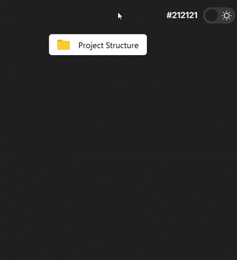

<div align="center">

## 👀 Preview
<sub><b>Scroll down to see the live animation preview.</b></sub>


<br>


</div>

<div align="center">

# 📂 Folder Hover

**A meticulously crafted folder-open animation, built in pure CSS.**

No JavaScript. No dependencies. Just a smooth, satisfying micro-interaction you can drop into any project.

<br />

[](https://developer.mozilla.org/en-US/docs/Web/HTML)
[](https://developer.mozilla.org/en-US/docs/Web/CSS)
[](#-license)

[](https://github.com/wearepixelflow/folder-hover-animation/stargazers)
[](https://github.com/wearepixelflow/folder-hover-animation/network/members)
[](https://github.com/wearepixelflow/folder-hover-animation/commits/main)
[](#-author)

<br />

[**Live Demo**](#-live-demo) · [Installation](#-installation) · [Customization](#-customization) · [Contributing](#-contributing)

</div>

<br />

<div align="center">
  
  <br />
  <sub>If the preview above doesn't load, see <a href="screenshot.png">screenshot.png</a> for a static reference.</sub>
</div>

<br />

---

## About

**Folder Hover** is a lightweight CSS component that recreates the tactile, satisfying feeling of a folder opening — triggered entirely by `:hover`. It's built for developers who want a polished detail without pulling in an animation library or a single line of JavaScript.

Drop it into a file manager UI, a dashboard, a portfolio, or a landing page — anywhere a small moment of delight belongs.

**Keywords:** CSS animation · hover effect · HTML CSS component · frontend UI · micro-interaction · modern UI · responsive design · open source frontend component

<br />

## Live Demo


<div align="center">

<a href="https://wearepixelflow.github.io/folder-hover-animation/" target="_blank">
  
</a>

<br><br>

<a href="https://wearepixelflow.github.io/folder-hover-animation/" target="_blank">
  
</a>

<br>

<sub><b>Click the preview above to experience the animation live.</b></sub>

</div>

<br />

## Features

<table>
<tr>
<td width="50%" valign="top">

### 🎬 Smooth Motion
Carefully tuned easing curves and timing make the folder open and close without a hint of jank.

</td>
<td width="50%" valign="top">

### 🪶 Zero Dependencies
Pure HTML & CSS. No build step, no npm install, no framework required.

</td>
</tr>
<tr>
<td width="50%" valign="top">

### ⚙️ Fully Customizable
Colors, speed, sizing, and spacing are all exposed as CSS variables.

</td>
<td width="50%" valign="top">

### 📱 Responsive by Default
Scales cleanly across breakpoints — from mobile to widescreen.

</td>
</tr>
<tr>
<td width="50%" valign="top">

### 🧩 Beginner-Friendly Code
Clean, commented markup and styles — easy to read, easy to extend.

</td>
<td width="50%" valign="top">

### ⚡ Instant Load
A few KB of CSS. No render-blocking scripts, no layout shift.

</td>
</tr>
</table>

<br />


## Usage

Every visual property is controlled through CSS custom properties defined at the top of `style.css`. Override them in your own stylesheet, or edit them directly:

```css
:root {
  --folder-color: #4a90e2;      /* primary folder color */
  --folder-accent: #f5a623;     /* inner tab / accent color */
  --animation-speed: 0.35s;     /* open/close transition duration */
  --animation-easing: ease-in-out;
  --folder-size: 120px;         /* base folder width */
  --folder-spacing: 24px;       /* gap between multiple folders */
}
```

| Variable | Controls | Default |
|---|---|---|
| `--folder-color` | Base folder color | `#4a90e2` |
| `--folder-accent` | Tab / highlight color | `#f5a623` |
| `--animation-speed` | Duration of the open/close transition | `0.35s` |
| `--animation-easing` | Timing function for the motion | `ease-in-out` |
| `--folder-size` | Width of the folder element | `120px` |
| `--folder-spacing` | Spacing between adjacent folders | `24px` |

<br />


## Browser Support

| Chrome | Firefox | Safari | Edge | Opera |
|:---:|:---:|:---:|:---:|:---:|
| ✅ | ✅ | ✅ | ✅ | ✅ |

Built on standard CSS transitions and transforms — no vendor-specific hacks required.

<br />

## Performance

- **No dependencies** — nothing to install, nothing to bundle.
- **No JavaScript** — the entire interaction is driven by CSS `:hover`.
- **Minimal footprint** — a few kilobytes of styling, nothing more.
- **Fast rendering** — GPU-accelerated transforms keep the animation smooth.
- **Responsive** — adapts cleanly to any screen size out of the box.

<br />

## Inspiration

This component is an educational recreation built to practice and demonstrate CSS animation techniques. It is not a copy of any single proprietary design, and no ownership is claimed over any original concept it may resemble. If you recognize a specific design this draws from, please open an issue and it will be credited here.

<br />

## Contributing

Contributions are welcome and appreciated.

1. Fork the repository
2. Create a feature branch (`git checkout -b feature/your-feature`)
3. Commit your changes (`git commit -m 'Add your feature'`)
4. Push to your branch (`git push origin feature/your-feature`)
5. Open a Pull Request

Please keep changes focused and consistent with the existing code style. For larger changes, open an issue first to discuss what you'd like to change.

<br />

## License

Released under the [MIT License](LICENSE). Free to use in personal and commercial projects.

<br />

## Author

<div align="center">

**PixelFlow**

Free UI animations, CSS components, and frontend tutorials.

[](https://github.com/wearepixelflow)
[](https://instagram.com/wearepixelflow)


</div>

<br />

## Support

If this project saved you time or sparked an idea, a star helps it reach more developers looking for the same thing.

<div align="center">

[](https://github.com/wearepixelflow/folder-hover-animation)

</div>

<br />

---

<div align="center">
<sub>Built with passion by <a href="https://github.com/wearepixelflow">PixelFlow</a></sub>
</div>
